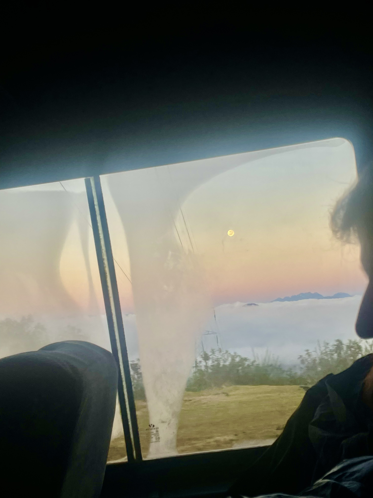

# Zihang He's Webpage
## _Markdown version for CSE110_

This serves as a practice for using markdown to create the first assignment for _CSE110 Software Engineering_.
An official portfolio can be accessed [here](). (this should be a link later but i haven't finished on building the portfolio, so nothing will happen if you clicked here :cry: sorry)
Or, skip the professional stuff and [get to know me](#personal-life), and check out this cool [drumkit webpage](https://zihang-he.github.io/drumkit-web-practice/) for fun!

## Skills

1. **Programming languages**
    - Python
    - Java
    - C, C++
2. **Software and Web Development**

    - HTML
    - CSS
    - Javascript (Node.js, React.js)
3. **Data Analytics**
    - R
    - Matlab
    - SPSS

## Personal Life

#### Something I HATE:

```
$ gcc segfault.c -g -o segfault
$ ./segfault
```

#### Something I like:

##### Traveling
[Workaway](https://www.workaway.info/) is a wonderful website to explore, it allows you to travel with minimal expense and be truly immersed in another culture!
Last summer I took a trip to Peru. From Lima to Cusco, I've went to Humantay, Machu Picchu, the local market (if you like to step out of the tourist perspective and see the life of the local people this is the place to go), experienced rafting and horse riding.

> The bus bumped along the way and I was sleepy. She woke me up and told me to look outside the window. What came to sight was first the full moon, and then swarms of clouds beneth, sticking low to the valley. I saw terraced fields and small houses of different colors. Clouds under my feet. The tip of the snow-capped mountain in the distance has a touch of bright red. Just now I was cursing the mountain road to have a sharp twist every ten meters which made me dizzy. Now I can only thank these roads for allowing me to witness the breathtaking scenery from different angles.        ---2022,8,12


##### Reading
- [x] The Stranger by Albert Camus
- [x] Walden by Henry David Thoreau

[readme for this project](README.md)